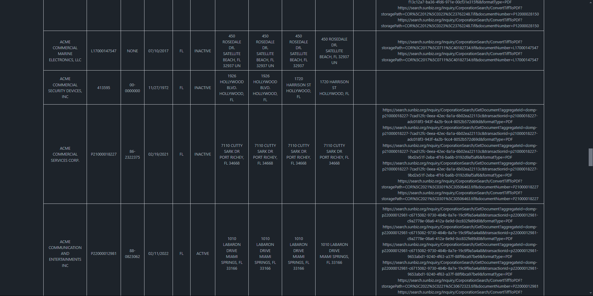
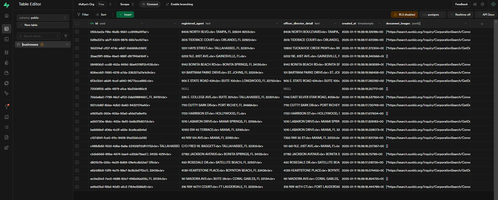

# Florida Business Crawler

This project is a microservice application designed to crawl the Florida Secretary of State website for publicly available business details. It consists of a backend service built with Python and Playwright, and a frontend application developed using ReactJS.

## Output
FRONTEND

DATA-BASE


## Setup Instructions

```sh
cp .env.example .env
```

### Backend

1. Navigate to the `backend` directory.
2. Install the required dependencies using:
   ```
   pip install -r requirements.txt
   ```
3. install playwright
   ```
   playwright install
   ```
4. Run the backend application:
   ```
   python main.py
   ```

### Frontend

1. Navigate to the `frontend` directory.
2. Install the required dependencies using:
   ```
   npm install
   ```
3. Start the frontend application:
   ```
   npm start
   ```
## Postman Collection
- Import Collection File in postman
- Test the RESTAPI
- 
## Usage

- Use the frontend search form to input a business name.
- The application will initiate a crawl of the Florida Secretary of State website and display the results in a tabular format.

## Architecture Overview

The project is structured to separate concerns between the backend and frontend, allowing for a clean and maintainable codebase. The backend handles data crawling and storage, while the frontend provides a user-friendly interface for searching and displaying business details.